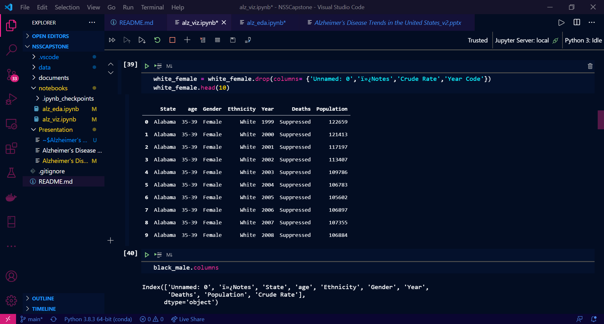

# Trends in Alzheimer's Disease Fatalities in Tennessee and the United States from 1999-2018. 
> In this project I analyse the demographics, frequency, and overall trend of fatalities from Alzheimer's Disease. 

## Table of contents
* [General info](#general-info)
* [Screenshots](#screenshots)
* [Technologies](#technologies)
* [Features](#features)
* [Status](#status)
* [Inspiration](#inspiration)
* [Contact](#contact)

## General info
This project was created as my Capstone for Nashville Software School, where I was in Data Analytics Cohort 2. I was drawn to this topic due to a familial connection and a long time fear of losing my mental/cognitive ability. 
## Screenshots

## Technologies
* Python - version 3.8.3
* Microsoft Power BI 
* Jupyter Notebook
* Microsoft Powerpoint

## Code Examples
`import pandas as pd 
import numpy as np 
import matplotlib.pyplot as plt 
import seaborn as sns  
 
%matplotlib inline` 
 
`white_ad = white_male.merge(white_female,how = 'outer',on = 'State')
white_ad.head(20)` 
 
`aging_data = pd.read_csv('../data/Alzheimer_s_Disease_And_Healthy_Aging_Data_edited.csv')
cog_dec = pd.read_csv('../data/Alzheimer_s_Disease_and_Healthy_Aging_Indicators__Cognitive_Decline.csv')
caregiving =  pd.read_csv('../data/Alzheimer_s_Disease_and_Healthy_Aging_Indicators__Caregiving.csv')
american_indian_female = pd.read_csv('../data/American Indian or Alaskan Native, Female, AD by State.csv',skipfooter = 76, engine = 'python')
american_indian_male = pd.read_csv('../data/American Indian or Alaskan Native, Male, AD by State.csv',skipfooter = 76, engine = 'python')
asian_male = pd.read_csv('../data/Asian or PI, Male, AD by State.csv', skipfooter = 78, engine = 'python')
asian_female = pd.read_csv('../data/Asian or PI, Female, AD by State.csv', skipfooter = 78, engine = 'python')
black_male = pd.read_csv('../data/Black, Male, AD by State.csv',skipfooter= 78,engine = 'python')
black_female = pd.read_csv('../data/Black, Female, AD by State (1).csv',skipfooter = 78, engine = 'python')
cumulative_72020 = pd.read_csv('../data/Cumulative_Provisional_Death_Counts_by_Sex__Race__and_Age_through_7_4_2020.csv')
hispanic_male = pd.read_csv('../data/Hispanic, Male, AD by State.csv',skipfooter = 75, engine = 'python')
hispanic_female = pd.read_csv('../data/Hispanic, Female, AD by State.csv',skipfooter = 77, engine = 'python')
multiple_causes = pd.read_csv('../data/Multiple Cause of Death, 1999-2018.csv')
white_male = pd.read_csv('../data/White, Male, AD by State.csv',skipfooter= 94, engine = 'python')
white_female = pd.read_csv('../data/White, Female, AD by State.csv',skipfooter = 78, engine = 'python')` 
 
## Features
* Description of what Alzheimer's Disease is.
* Visualizations of important statistics 
* Resources for self or loved ones. 

## Status
Project is:  _finished_, but there is always more work to be done to cure this disease. 

## Inspiration
Project inspired by late family members of mine that went through the stges of Dementia (the overall disease of which Alzheimer's is only a portion).

## Contact
Created by @MrBardot. Feel free to contact me!